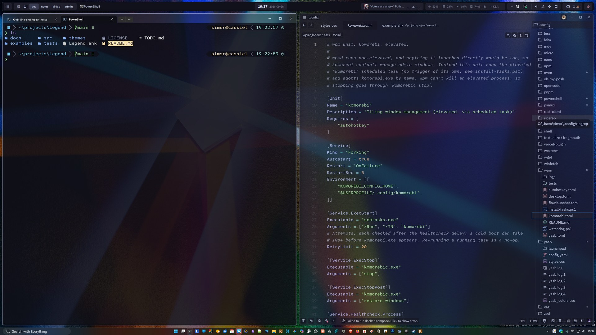
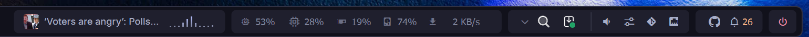

# w11dwm-config

My Windows 11 desktop and window-management setup, shared here so it can be
discussed. It's a tiling window manager driven entirely from the keyboard, with a
custom status bar and a launcher, themed with Catppuccin Mocha throughout.



| Tool | Role | Folder | Lives at |
| --- | --- | --- | --- |
| [komorebi](https://github.com/LGUG2Z/komorebi) | Tiling window manager | [`komorebi/`](komorebi) | `~/.config/komorebi` (`KOMOREBI_CONFIG_HOME`) |
| [AutoHotkey v2](https://www.autohotkey.com/) | All key bindings (replaces whkd), plus a which-key-style app launcher | [`autohotkey/`](autohotkey) | `~/.config/AutoHotKey` |
| [yasb](https://github.com/amnweb/yasb) | Status bar (replaces komorebi-bar) | [`yasb/`](yasb) | `~/.config/yasb` |
| [Flow Launcher](https://www.flowlauncher.com/) | Search and launcher (`Ctrl + ~`) | [`flowlauncher/`](flowlauncher) | `%APPDATA%\FlowLauncher` → `~/.config/FlowLauncher` |
| [wpm](https://github.com/LGUG2Z/wpm) | Process manager. Runs watchdogs that keep yasb, AutoHotkey and Flow Launcher alive | [`wpm/`](wpm) | `~/.config/wpm` |

How it all starts at logon (scheduled tasks, elevation, environment): see [`startup/`](startup).

## How the pieces fit together

- **Workspaces:** these are named workspaces spread over two monitors, defined in `komorebi/komorebi.json`:
  - 4K: `1 dev` · `2 notes` · `3 ai-lab` · `4 admin`
  - LG: `5 research` · `6 comms` · `7 files` · `8 games` · `9 scratch`

  `initial_workspace_rules` put each app on its home workspace when it opens.
- **Keys (AutoHotkey → komorebic):** `autohotkey/WindowManager.ahk` follows komorebi's
  sample whkdrc, with **Alt** as the WM modifier (`Alt+h/j/k/l` to focus, `Alt+1..9` to change workspace,
  `Alt+Shift+1..9` to move a window to a workspace, …). It calls `komorebic` through the small wrapper
  in `autohotkey/Lib/Komorebi.ahk`. `Alt+/` opens [Legend](https://github.com/simsrw73/Legend.ahk),
  an overlay listing every binding for the app you're in.
- **Without komorebi:** `Alt+h/j/k/l` still move focus, to the nearest visible window in that
  direction, crossing to the next monitor at the edge (Legend's `LegendWindows.Focus`).
- **Window switchers:** `Alt+A` (all windows) and `Alt+S` (this monitor) open Legend window
  pickers: `Ctrl+N/P` move, a letter or Enter switches, `/` filters, `Ctrl+T` changes scope. Windows on
  hidden komorebi workspaces show their workspace and switch to it.

  
- **App chords:** `Win+Space` opens a which-key style menu (`autohotkey/Chords.ahk`, built on
  [Legend](https://github.com/simsrw73/Legend.ahk)'s chord mode). Pressing a key focuses that app, or launches it if it isn't running, and
  komorebi's rules take care of which workspace it lands on. Apps are defined once in
  `autohotkey/Apps.ahk`.

  
- **Bar:** yasb reads komorebi's state for its workspace and layout widgets. It has a full
  bar on the primary monitor and a slim one on the others.

  
  
- **Startup and supervision:** wpm starts the desktop at logon. It runs komorebi elevated
  through a scheduled task, and runs yasb, the main AutoHotkey script and Flow Launcher
  through `wpm/watchdog.ps1`, which restarts them if they exit (and yasb if it hangs).
  [`wpm/README.md`](wpm/README.md) explains why.

## About this repo

The real files live in my [dotfiles repo](https://github.com/simsrw73/dotfiles-windows), applied to `~/.config`. [`sync.ps1`](sync.ps1)
copies an explicit allowlist from there into this repo, mirroring deletions, and then
scans the result for anything that looks like a secret. Flow Launcher plugins are listed in
[`flowlauncher/plugins.md`](flowlauncher/plugins.md) and the plugin binaries aren't included.

```powershell
./sync.ps1        # then review `git diff` and commit
```

Paths in these configs contain my username (`simsr`) and my install locations. Adjust
them for your own machine.

## Related

This repo is the desktop part of my dotfiles, published on its own. These are the projects around it:

- **[dotfiles-windows](https://github.com/simsrw73/dotfiles-windows)**: My whole Windows setup, managed with chezmoi: `~/.config`, the PowerShell profile, apps, keys and secrets. The other projects here are either used by it or published from it.
- **[Legend.ahk](https://github.com/simsrw73/Legend.ahk)**: An AutoHotkey v2 library: an Alt+/ overlay of the shortcuts for the app you're in, which-key style chord menus, pickers and a window switcher. It runs the keys in w11dwm-config and dotfiles-windows.
- **[DotForge](https://github.com/simsrw73/DotForge)**: A PowerShell module that installs and configures command-line tools: XDG paths, fzf pickers, completions, shell hooks. The PowerShell profile in dotfiles-windows loads it, and it sets up Starship to read the starship-p9cat config.
- **[starship-p9cat](https://github.com/simsrw73/starship-p9cat)**: A Starship prompt in the powerlevel9k style, in Catppuccin colors. It's the prompt in dotfiles-windows, and a port of the CatPow theme from poshcat.omp.
- **[poshcat.omp](https://github.com/simsrw73/poshcat.omp)**: Catppuccin themes for Oh My Posh, including CatPow, a powerlevel10k-style theme. It was my prompt before Starship; starship-p9cat carries CatPow over.

## License

[MIT](LICENSE) covers my files. `autohotkey/Lib/Legend` is a submodule pointing to
[simsrw73/Legend.ahk](https://github.com/simsrw73/Legend.ahk), which has its own MIT license.
Clone with `git clone --recurse-submodules`, or run `git submodule update --init` after cloning.
